  

 

<strong>🏳️Languages: 🇬🇧English - <s><a href="readme-de-de.md">🇩🇪Deutsch</a></s></strong>

# Hi there 👋

I’m **Tobias** (he/him), a tech enthusiast from Germany 🇩🇪. I attend a school focused on technology, where I’m currently learning **Kotlin** and **Assembly**.

## 🛠️ Projects:
I’m developing a **web app for TTRPG DMs and players** to store and manage character information, with integration support for custom projects.  
Links 🔗:
- [**dnd5eexplorer**](https://doctor-versum.github.io/dnd5eexplorer)
- [**Dicebase (main website - WIP)**](https://dicebase.web.app)  
- Other projects can be found on my [about page](https://doctor-versum.github.io).

  
<strong>📋Important Projects</strong>

  <a href="<!--link-repo-1-->"></a>
  <a href="<!--link-repo-2-->"></a>
  <a href="<!--link-repo-3-->"></a>
  <a href="<!--link-repo-4-->"></a>
  <a href="<!--link-repo-5-->"></a>

## 🎮 Stuff I like:
I’m a big fan 𖣘 of **video games** 🎮 and **TTRPGs** 🧝.  
My favourite video games of all time are:
- *Satisfactory* 🏭
- *Scrap Mechanic* ⚙️
- *Portal (1 & 2)* 🌀
- *Minecraft* ⛏️

## 🎨 My favourite colors:
- Cyan / Light blue 🩵
- Blue 💙
- Magenta / Purple 💜

## 📬 You can reach me on:
- **Discord**: 
- **Reddit**: 

## 🪢 My tech:

  
<strong>💻 Computers & Monitors</strong>

  <ul>
    <li><strong>💻 Primary laptop</strong>: Lenovo Ideapad 3
      <ul>
        <li>🔧 Intel Core i5</li>
        <li>🎨 Intel Iris Xe Graphics</li>
        <li>🧠 8 GB RAM</li>
      </ul>
    </li>
    <li><strong>🧪 Lab rat</strong>: Lenovo B580
      <ul>
        <li>🔧 Intel Pentium</li>
        <li>🎮 AMD Radeon Graphics</li>
        <li>🧠 4 GB RAM</li>
      </ul>
    </li>
    <li><strong>📺 Secondary monitor</strong>: ThinkVision (portrait orientation)</li>
  </ul>

  
<strong>🖱️ Peripherals</strong>

  <ul>
    <li><strong>🖱️ Mouse</strong>: Cheap mouse (don’t remember the model)</li>
    <li><strong>🔈 Speakers</strong>: Teufel Kombo 11</li>
    <li><strong>🎤 Microphone</strong>: DJI Mic Mini (2 transmitters)</li>
    <li><strong>🎆 Launchpad</strong>: Novation Launchpad Mini MK3</li>
  </ul>

  
<strong>📱 Other devices</strong>

  <ul>
    <li><strong>📱 Phone</strong>: Pixel 6 Pro</li>
    <li><strong>🖥️ Tablet</strong>: iPad 10th Gen (for school)</li>
    <li><strong>🖥️ Tablet</strong>: Samsung Galaxy Tab A7</li>
    <li><strong>🥽 VR</strong>: Meta Quest 3</li>
  </ul>

## 🛠️ Other tools I use:
- GitHub Pages ⚫️
- Firebase 🔥
- ChatGPT 🌼
- GitHub Copilot 🤖
- Flask 🌐

## ⌨️ Programming languages:
- **Python** 🐍
- **HTML & CSS** (I know, it's technically not "programming" – Sue me!📖)
- **JavaScript** _JS_
- **Kotlin** _Kt_
- **MCFunction** ⛏️
- **Verilog** (god, I hate Verilog!) _v_
- **Assembly** 💽
- **C++** _C_
- A little bit of **Java** ☕️

## 🏳️ IRL languages:
- **German** 🇩🇪
- **English** 🇬🇧

## ⚡ Fun fact:
My first experience with programming was with a **Fischertechnik Robotics LT controller**.

  
<h3>📉 current stats:</h3>

  <!-- GitHub Stats -->
  
  
  <!-- GitHub Streak -->
  
  <!-- Trophies -->
  
  
  

# Thanks for reading my Readme ;)