 

## Hi there 👋

I’m **Tobias** (he/him), a tech enthusiast from Germany 🇩🇪. I attend a school focused on technology, where I’m currently learning **Kotlin** and **Assembly**.

### 🛠️ Projects:
I’m developing a **web app for TTRPG DMs and players** to store and manage character information, with integration support for custom projects.  
Links 🔗:
- [**dnd5eexplorer**](https://doctor-versum.github.io/dnd5eexplorer)
- [**Dicebase (main website - WIP)**](https://dicebase.web.app)  
- Other projects can be found on my [about page](https://doctor-versum.github.io).

### 🎮 Stuff I like:
I’m a big fan 𖣘 of **video games** 🎮 and **TTRPGs** 🧝.  
My favourite video games of all time are:
- *Satisfactory* 🏭
- *Scrap Mechanic* ⚙️
- *Portal (1 & 2)* 🌀
- *Minecraft* ⛏️

### 🎨 My favourite colors:
- Cyan / Light blue 🩵
- Blue 💙
- Magenta / Purple 💜

### 📬 You can reach me on:
- **Discord**: 
- **Reddit**: 

### 🪢 My tech:
- **Primary laptop** 💻: Lenovo Ideapad 3
  - Intel Core i5
  - Intel Iris Xe Graphics
  - 8 GB RAM
- **Secondary monitor** 📺: ThinkVision (portrait orientation)
- **Mouse** 🖱️: Cheap mouse (don’t remember the model)
- **Speakers** 🔈: Teufel Kombo 11
- **Microphone** 🎤: DJI Mic Mini (2 transmitters)
- **VR**: Meta Quest 3
- **Tablet** 🖥️: iPad 10th Gen (for school)
- **Tablet** 🖥️: Samsung Galaxy Tab A7
- **Phone** 📱: Pixel 6 Pro
- **Launchpad** 🎆: Novation Launchpad Mini MK3
- **Lab rat** 🧪: Lenovo B580 (4 GB)
  - Intel Pentium
  - AMD Radeon Graphics
  - 4 GB RAM

### 🛠️ Other tools I use:
- GitHub Pages ⚫️
- Firebase 🔥
- ChatGPT 🌼
- GitHub Copilot 🤖
- Flask 🌐

### ⌨️ Programming languages:
- **Python** 🐍
- **HTML & CSS** (I know, it's technically not "programming" – Sue me!📖)
- **JavaScript** _JS_
- **Kotlin** _Kt_
- **MCFunction** ⛏️
- **Verilog** (god, I hate Verilog!) _v_
- **Assembly** 💽
- **C++** _C_
- A little bit of **Java** ☕️

### 🏳️ IRL languages:
- **German** 🇩🇪
- **English** 🇬🇧

### ⚡ Fun fact:
My first experience with programming was with a **Fischertechnik Robotics LT controller**.

### 📉 current stats:

